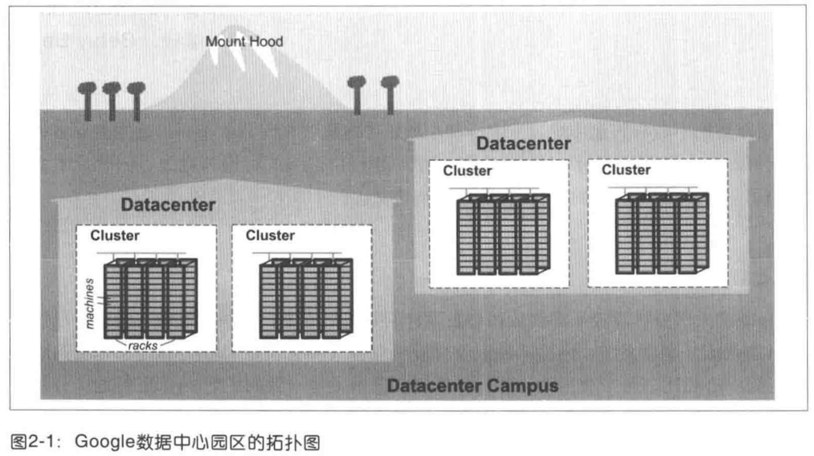
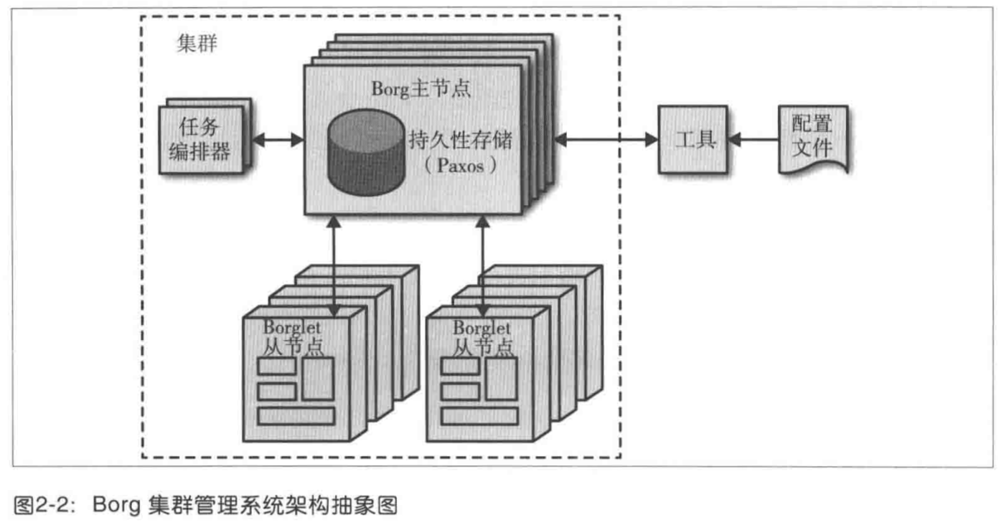
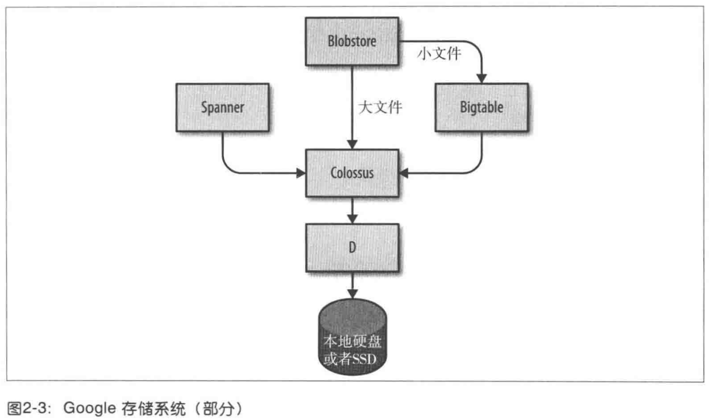

**一个典型的 Google 数据中心的拓扑结构：**
- 约 10 台物理服务器组成一个机柜（Rack）
- 数台机柜组成一个机柜排（Row）
- 一排或多排机柜组成一个集群（Cluster）
- 一般来说，一个数据中心（Datacenter）包含多个集群
- 多个相邻的数据中心组成了一个园区（Campus
）

**Borg**

Borg 负责集群层面管理任务的编排工作。其实和 Apache Mesos 类似，如果大家曾经接触过 Kubernetes，应该会很熟悉，因为 K8S 就是 Borg 的升级版。

**StoreSystem**

**Network**

- 路由器：基于 OpenFlow 协议的软件定义网络（SDN）
- 网络带宽：带宽控制器（Bandwidth Enforcer, BwE）负责所有可用带宽。
    > 有些服务包括运行在不同集群上的任务，这些集群通常是分布全球的。为了降低分布式集群的服务延迟，我们希望能够讲用户指派给距离最近、有空余容量的数据中心处理。我们的全球负载均衡系统（GSLB）在三个层面上负责负载均衡工作：
    - 利用地理位置信息进行负载均衡 DNS 请求（例如 www.ggogle.com 的解析）
    - 在用户服务层面进行负载均衡，例如 YouTube 和 Google Maps。
    - 远程调用（RPC）层面惊醒负载均衡。
    > 每个服务的管理者在配置文件中给服务起一个名称，同时指定一系列的 BNS 地址，以及每个 BNS 地址可用的容量（通常，容量的单位是 QPS，美妙请求数量）。GSLB 会自动将用户流量导向到合适的为止。
