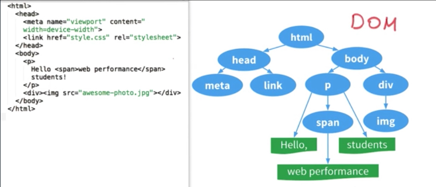
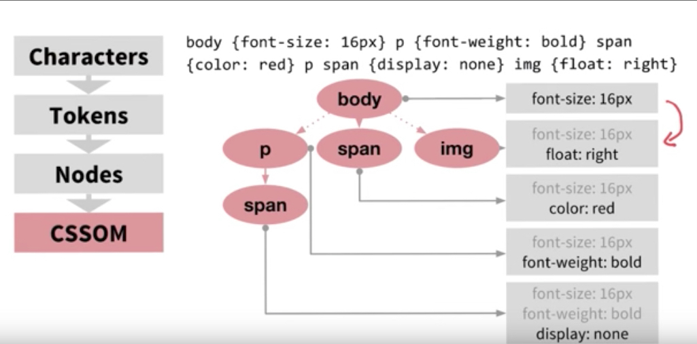
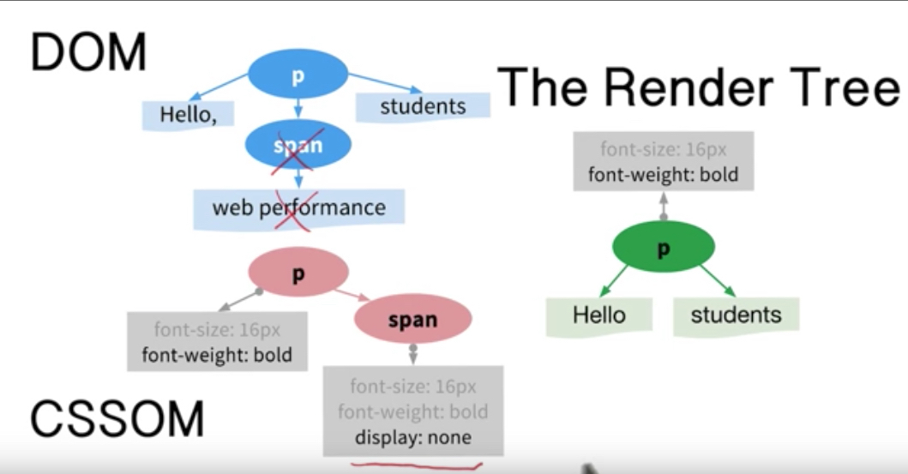

## Reflow and Repaint ##


__ How does browser display your page? __

Here's a image showing the general process.


这张图应该可以很好理解，归纳为四个步骤:

    1. 解析HTML以构建DOM树：渲染引擎开始解析HTML文档，转换树中的html标签或js生成的标签到DOM节点，它被称为 -- 内容树 (`DOM Tree`)。
    2. 构建渲染树：解析CSS（包括外部CSS文件和样式元素以及js生成的样式），根据CSS选择器计算出节点的样式，创建另一个树 —- 渲染树 (`Rendering Tree`)。
    3. 布局渲染树: 从根节点递归调用，计算每一个元素的大小、位置等，给每个节点所应该出现在屏幕上的精确坐标。
    4. 绘制渲染树: 遍历渲染树，每个节点将使用UI后端层来绘制。

举个例子:

1. 根据浏览器的解析过程，浏览器首先会将上面的html解析为如下的一个dom树

2. 根据css样式表生成CSSOM

3. DOM + CSSOM = RenderTree


对比dom树与render树，可以发现少了head和被隐藏的元素；因为render树只包括可见的元素部分，具体的说，是从page的(0,0)坐标到(window.innerWidth, window.innerHeight)构成的矩形区域；


__Repaint And Reflow__

从上面的流程中，可以看到页面初始化时，至少有一次 layout 和 paint；这个过程是不可缺少的，那么我们通常所提到的reflow和repaint是什么？

    1. reflow: 当页面上有一些信息变化时，如大小、位置变化；浏览器可能会需要重新计算元素的展示样式，这个过程称为reflow；
    2. repaint: 当元素的位置、大小等属性确定好后，浏览器会把这些元素重新绘制一遍，这个过程称为repaint；

__引起Repaint和Reflow的一些操作__

Reflow 的成本比 Repaint 的成本高得多的多。DOM Tree 里的每个结点都会有 reflow 方法，一个结点的 reflow 很有可能导致子结点，甚至父点以及同级结点的 reflow。在一些高性能的电脑上也许还没什么，但是如果 reflow 发生在手机上，那么这个过程是非常痛苦和耗电的。

__以下行为会造成reflow或者repaint__

    当对元素进行增删改操作时；
    当元素的位置变化时；
    新增stylesheet，修改样式表时；
    window resize或者滚动的时候；
    修改网页字体时；
    通过display:none隐藏展示元素时会造成reflow和repaint，通过visibility:hidden；只会repaint，因为位置没变化；
    
__影响 layout 的属性__

    宽高| 边距| 位置| 表现| 边框| 定位| 字体|
    —|—|—|—|—|—|—
    width| padding| position| display| border| text-align| font-size|
    height| margin| top|float| border-width| overflow-y| font-weight|

__影响repaint的属性__

    背景 | 边框 | 其他 |
    —|—|—|
    background| border-style| color|
    background-image| border-radius| visibility|
    background-repeat| outline| text-decoration|
    background-position| outline-style| box-shadow|
    background-size| outline-color|- |
    outline-width| -| 

__优化建议__
1. 不要一条一条地修改 DOM 的样式。与其这样，还不如预先定义好 css 的 class，然后修改 DOM 的 className：
```
// bad
var left = 10,
top = 10;
el.style.left = left + "px";
el.style.top  = top  + "px";
// better
el.className += " theclassname";
```

2. 把 DOM 离线后修改。如：
    - 使用 documentFragment 对象在内存里操作 DOM。
    - 先把 DOM 给 display:none (有一次 repaint)，然后你想怎么改就怎么改。比如修改 100 次，然后再把他显示出来。
    - clone 一个 DOM 节点到内存里，然后想怎么改就怎么改，改完后，和在线的那个的交换一下。

3. 不要把 DOM 节点的属性值放在一个循环里当成循环里的变量。不然这会导致大量地读写这个结点的属性。

4. 尽可能修改靠近叶子的节点。当然，改变层级比较底的 DOM节点有可能会造成大面积的 reflow，但是也可能影响范围很小。

5. 为动画的 HTML 元件使用 fixed 或 absolute 的 position，那么修改他们的 CSS 是会大大减小 reflow。

6. 千万不要使用 table 布局。因为可能很小的一个小改动会造成整个 table 的重新布局。


> References:
- [repaint与reflow](https://blog.kaolafed.com/2017/03/30/repaint%E4%B8%8Ereflow/)
- JavaScript DOM 编程艺术